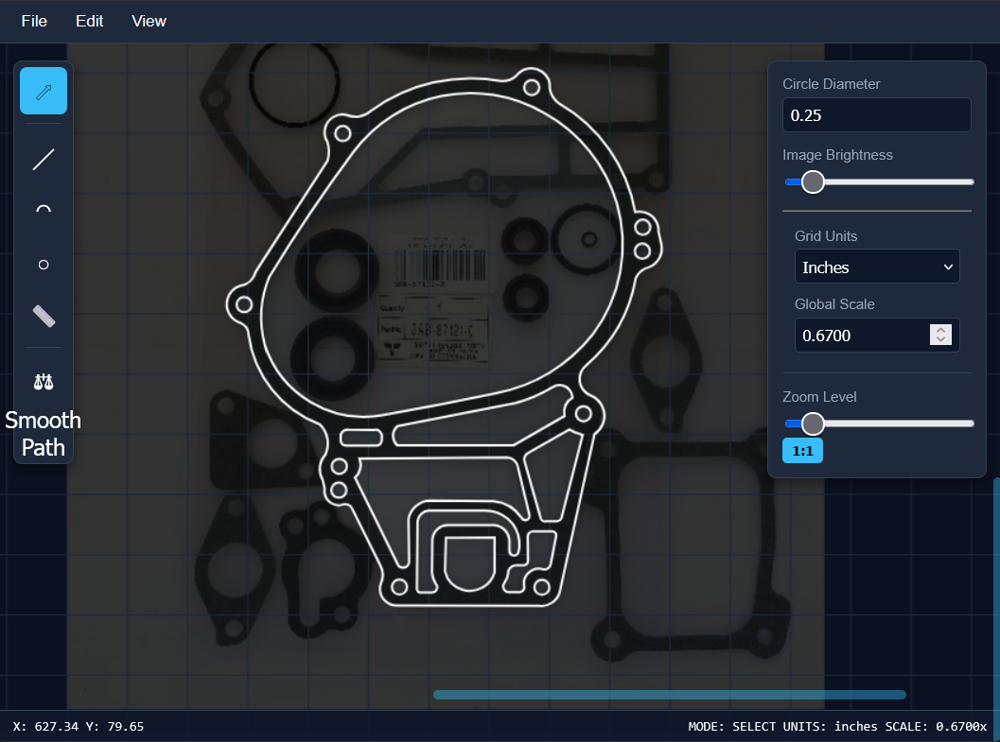

    
    Gasketter - a web based gasket design tool. Take a picture of the item which needs a gasket, load it as a background image in the tool, scale it and design the gasket using lines and arcs.
    Print the gasket or export to png, g-code, plotter or svg format.
    
[Try it here!](https://github.com/highwheeler/gasketter/edit/main/index.html).
